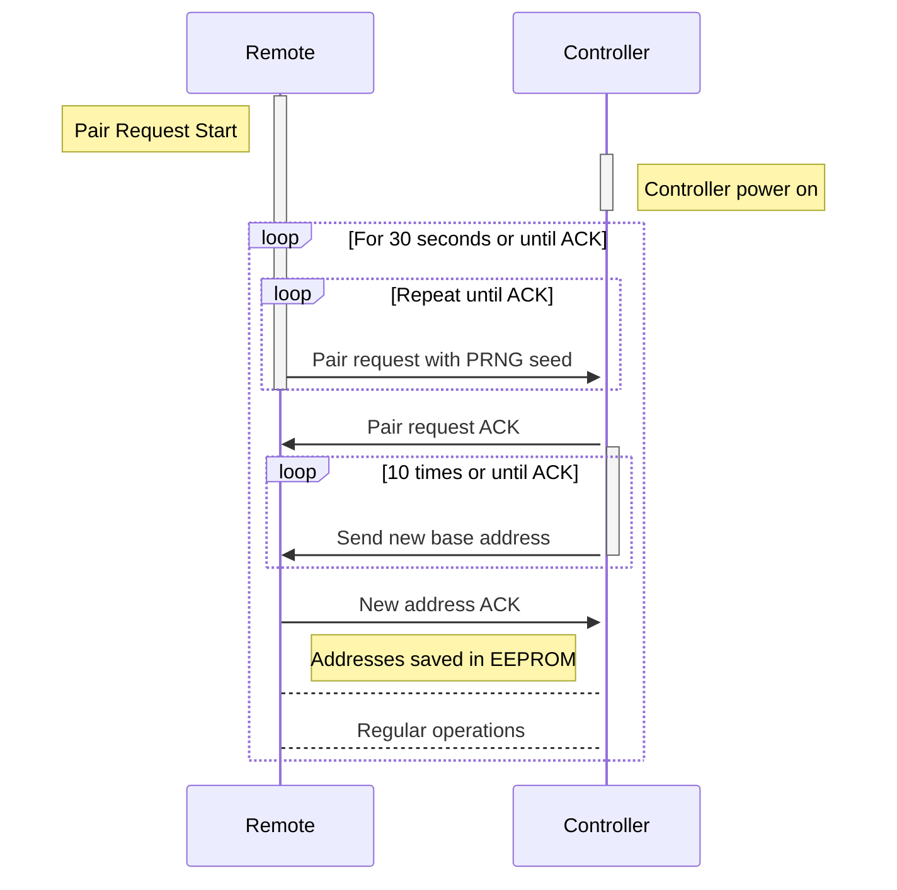

# nRF24L01 Wireless Remote

Code meant to run on AVR-based hardware to transmit and recieve radio signals from the nRF24L01 module
for throttle control, with additional features for pairing, speed calculations, and battery level 
monitoring. This code contains the code necessary for both the remote and the onboard vehicle controller,
and compiling and uploading for either device is determined in `settings.h`

## Features

- Throttle control 
- Pairing and persistent data storage
- Configurable power and data transmission speeds

### Future features

- LCD Display
- Configurable settings including throttle and braking ranges
- Speedometer display
- Power-loss/Connection-loss failsafe

## Pairing

On the remote, hold the function button down and turn on the power. In the settings, select the pair 
function using the function button to start pairing. Then power cycle the controller and the pairing 
process should begin. If the pair fails, try power cycling the controller again or if the remote times 
out, press the function button again.

Without the LCD display currently, remote pairing is done by starting the controller with the joystick
in the downmost position

## Advanced Information

### Packet types (Data is in Network order [Big Endian])
| Prefix | Data length | Prefix Description  | Data Contents             | Direction            |
|--------|-------------|---------------------|---------------------------|----------------------|
| 0x10   | 1 byte      | Battery Level       | 0-100 battery percentage  | Controller -> Remote |
| 0x11   | 4 bytes     | RPM                 | Signed integer for rpm    | Controller -> Remote |
| 0x20   | 2 bytes     | Throttle            | Signed short for throttle | Remote -> Controller |
| 0xfe   | 5 bytes     | Address Change      | Base address              | Controller -> Remote |
| 0xff   | 5 bytes     | Pairing request     | Pseudorandom seed         | Remote -> Controller |

### Pairing handshake

